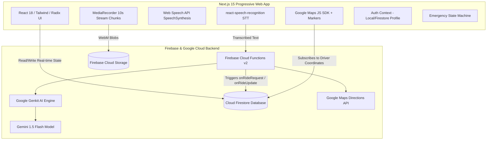

# NIA Safety Rides 🚗🛡️

> **Safety-First, Voice-Driven Ride-Hailing & Emergency Assistance Progressive Web Application (PWA)**  
> Built with Next.js 15, Google Genkit (Gemini 1.5 Flash), Firebase Cloud Functions v2, Cloud Firestore, and the Google Maps Platform.

---

## 📌 Overview & Problem Statement

Standard ride-hailing applications assume the user is situated in a safe, calm environment with continuous two-handed visual access to their smartphone screen. In high-risk transit situations, late-night travel, or physical emergencies, navigating complex touch menus is impractical or dangerous.

**NIA Safety Rides** unifies **hands-free natural language transit hailing** with an **instant multi-modal emergency distress system**:
1. **Conversational Voice Transit**: Riders can request rides, specify destinations, select transport tiers (Cab, Auto, Bike), review calculated fares, and confirm bookings completely hands-free in English, Hindi, and Hinglish.
2. **Instant Emergency Response**: Spoken distress triggers (*"help"*, *"emergency"*, *"bachao"*, *"madad"*) or manual SOS actions immediately launch a full-screen emergency protocol that streams 10-second video/audio evidence chunks directly to Firebase Storage and copies GPS coordinates.
3. **Reactive Proximity Dispatch**: Cloud Firestore triggers calculate the Haversine spherical distance between pickup coordinates and online drivers to dispatch the nearest vehicle with automated retry fallback.

---

## 🚀 Key Features

### 🎙️ Voice-Activated Ride Hailing
- **Natural Language Intent Parsing**: Powered by Google Genkit + Gemini 1.5 Flash to classify intent (`RIDE_REQUEST`, `SOS_REQUEST`, `CANCEL_RIDE`, `CONFIRMATION_YES`, `CONFIRMATION_NO`).
- **Conversational Multi-Turn Dialog**: State machine (`IDLE` -> `PARSING` -> `AWAITING_MODE_CONFIRMATION` -> `AWAITING_FINAL_CONFIRMATION` -> `EXECUTING`) with native browser speech synthesis.

### 💰 Real-Time Google Maps Fare Calculation
- **Directions API Integration**: Authenticated Firebase Cloud Function (`estimateFare.ts`) calculates route distance and duration.
- **Multi-Tier Vehicle Pricing**: Computes exact rates across **Cab** (₹50 base, ₹12/km, ₹2/min), **Auto** (₹30 base, ₹8/km, ₹1.5/min), and **Bike** (₹20 base, ₹6/km, ₹1/min).

### 📍 Reactive Firestore Driver Matching & Tracking
- **Proximity Search**: Event-driven Cloud Functions (`onRideRequest`) match the closest online driver via Haversine distance.
- **Decline Fallback**: If a driver declines, `onRideUpdate` automatically re-runs proximity search for the next nearest driver.
- **Concurrency Protection**: Driver acceptance runs inside atomic Firestore transactions (`db.runTransaction`) to prevent double-booking.
- **Live Vector Map**: Real-time vehicle rotation matching driver compass heading, pickup pins, and destination markers.

### 🚨 Cloud Emergency Evidence Recorder
- **Continuous 10-Second Chunk Streaming**: Dual-stream microphone/camera recording chunked and uploaded to Firebase Storage (`incidents/{incidentId}/{chunkId}.webm`).
- **One-Touch Emergency Actions**: Instant GPS location link copying (`https://www.google.com/maps?q=lat,lng`), direct authority dialing (`tel:100`), and live camera viewfinder.

---

## 🏗️ System Architecture



---

## 🔍 Feature Transparency Matrix

| Feature Area | Status | Implementation Evidence |
|---|---|---|
| **Multi-Turn Voice Booking State Machine** | `VERIFIED IMPLEMENTED` | `src/components/HomeClient.tsx`, `VoiceListener.tsx` |
| **Genkit Multi-Intent Natural Language Engine** | `VERIFIED IMPLEMENTED` | `functions/src/simple-flow.ts` (Zod schemas & prompt pipelines) |
| **Google Directions API Multi-Tier Fare Engine** | `VERIFIED IMPLEMENTED` | `functions/src/estimateFare.ts` (Callable Function) |
| **Reactive Firestore Driver Dispatch Engine** | `VERIFIED IMPLEMENTED` | `functions/src/notifications.ts` (`onRideRequest` / Haversine) |
| **Atomic Ride Acceptance Transaction** | `VERIFIED IMPLEMENTED` | `functions/src/rideHandlers.ts` (`db.runTransaction`) |
| **Emergency Video/Audio Chunk Streaming** | `VERIFIED IMPLEMENTED` | `src/contexts/EmergencyContext.tsx` (`MediaRecorder` -> Storage) |
| **Live Interactive Google Map & Heading Markers** | `VERIFIED IMPLEMENTED` | `src/components/MapComponent.tsx` |
| **System Diagnostics & AI Doctor Tooling** | `VERIFIED IMPLEMENTED` | `src/app/debug/page.tsx`, `functions/src/debug.ts` |
| **Client Authentication State** | `SIMULATED SESSION` | `src/contexts/AuthContext.tsx` (Persistent local mock session) |
| **Voice Destination Geocoding** | `PARTIALLY IMPLEMENTED` | Uses coordinate offset placeholder prior to fare engine |
| **Automated Cellular SMS / WhatsApp Gateway** | `PARTIALLY IMPLEMENTED` | Generates clipboard links / `tel:100` protocols |
| **Firebase Data Connect (PostgreSQL)** | `UNUSED ARTIFACT` | Starter template from initial workspace; Firestore is the real database |

---

## 🛠️ Quickstart & Local Setup

### 1. Prerequisites
- Node.js 18 or 20+
- Firebase CLI (`npm install -g firebase-tools`)
- Google Cloud / Firebase Project with Firestore, Functions, and Storage enabled.
- Google Maps JavaScript API Key & Directions API Key.
- Google Gemini API Key (`GOOGLE_GENAI_API_KEY`).

### 2. Installation
```bash
# Clone the repository
git clone https://github.com/Nia00-glitch/studio.git
cd studio

# Install root Next.js dependencies
npm install

# Install Cloud Functions dependencies
cd functions && npm install && cd ..
```

### 3. Environment Variables
Create `.env` in the root directory:

```env
# Firebase Client SDK Configuration
NEXT_PUBLIC_FIREBASE_API_KEY=your_firebase_api_key
NEXT_PUBLIC_FIREBASE_AUTH_DOMAIN=your_project.firebaseapp.com
NEXT_PUBLIC_FIREBASE_PROJECT_ID=your_project_id
NEXT_PUBLIC_FIREBASE_STORAGE_BUCKET=your_project.appspot.com
NEXT_PUBLIC_FIREBASE_MESSAGING_SENDER_ID=your_sender_id
NEXT_PUBLIC_FIREBASE_APP_ID=your_app_id

# Google Maps API Key
NEXT_PUBLIC_GOOGLE_MAPS_API_KEY=your_maps_javascript_api_key
```

Create `functions/.env`:
```env
GOOGLE_GENAI_API_KEY=your_gemini_api_key
GOOGLE_MAPS_API_KEY=your_maps_directions_api_key
```

### 4. Running the Development Server
```bash
# Start Next.js development server
npm run dev

# (Optional) Start Firebase Emulators in a separate terminal
firebase emulators:start
```

Visit `http://localhost:9002` in your browser.

---

## 📚 Project Documentation

- 🏛️ [System Architecture](docs/ARCHITECTURE.md) — Comprehensive technical architecture, reactive triggers, and data models.
- 💡 [Engineering Highlights](docs/ENGINEERING-HIGHLIGHTS.md) — Concurrency control, voice state machines, and media streaming.
- 📋 [Feature Status](docs/FEATURE-STATUS.md) — Detailed feature traceability matrix.
- 🔒 [Security & Compliance](docs/SECURITY.md) — Firestore security rules, threat model, and auth guidelines.
- 💻 [Development Guide](docs/DEVELOPMENT.md) — Local testing, diagnostic tools, and debugging procedures.
- 🧪 [Test Results](TEST-RESULTS.md) — Typecheck and production build verification logs.

---

## 📄 License
Open source under the [MIT License](LICENSE).
