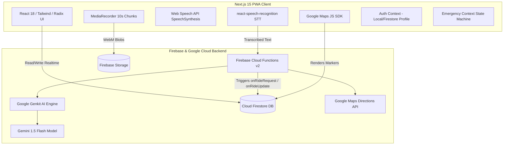

# Project Understanding Report: NIA Safety Rides (Repository: `studio`)

**Project Identifier**: Project A  
**Repository Directory**: `C:\Users\Arsh\studio`  
**Git Remote**: `https://github.com/Nia00-glitch/studio.git`  
**Current Branch**: `master`  
**Commit Hash**: `528c212903565e3170e7ea2f10b77764d8aee3a5`  
**Proposed Public Presentation Name**: **NIA Safety Rides**  
**Investigation Date**: 2026-08-20  

---

## 1. Actual Project Purpose

**NIA Safety Rides** is a safety-first, voice-enabled ride-hailing Progressive Web Application (PWA) built for transit environments where quick, hands-free interaction and personal safety are paramount. The platform brings together two core engineering domains:
1. **Hands-Free Transit Hailing**: Enables riders to request rides, select transport modes (Cab, Auto, Bike), review pricing, and track drivers entirely through natural language voice commands (in English, Hindi, and Hinglish) or standard touch UI.
2. **Instant Emergency Distress Response**: A multi-modal safety system activated via distress voice triggers (e.g., "help", "emergency", "bachao", "madad") or dedicated SOS controls, initiating background video/audio recording chunk uploads to cloud storage and broadcasting live GPS coordinates.

---

## 2. Problem Being Solved

- **Inaccessible Ride Booking in Motion/Distress**: Traditional ride-hailing apps require complex multi-step touch interactions, which are difficult or impossible to perform when in a hurry, multitasking, or in a vulnerable physical situation.
- **Fragmented Emergency Safety Tools**: Standalone safety apps rarely integrate directly with actual transportation workflows, forcing riders to switch between navigation and emergency tools when feeling unsafe.
- **Safety in Transit for Drivers & Riders**: Provides drivers with voice-announced ride notifications and one-tap acceptance, while providing riders with verified driver tracking and immediate distress broadcasting.

---

## 3. Target Users

1. **Riders**: Commuters, late-night travelers, and vulnerable passengers who need reliable transit with hands-free voice booking and instant, continuous emergency recording capabilities.
2. **Drivers**: Vehicle operators (Cab, Auto, Bike) receiving real-time proximity-based ride dispatches with voice-announced requests, transparent fare calculations, and navigation coordinates.
3. **Emergency Contacts & Responders**: Pre-configured family members or emergency personnel who receive location links and access uploaded incident recordings during emergencies.

---

## 4. Real User Workflow

```
[ Rider Experience ]
1. Sign In / Profile Creation -> Select 'Rider' role -> Save Emergency Contacts.
2. Allow Geolocation -> View dynamic Google Map centered on live position with nearby online drivers.
3. Speak Ride Request (e.g., "NIA book a ride to Cyberhub") -> Genkit AI parses destination -> Backend calculates multi-tier fare quote.
4. Voice Dialog Confirmation -> Rider confirms vehicle mode ("Cab") & price -> Ride document created in Firestore ('pending').
5. Backend Reactive Dispatch -> Nearest driver matched via Haversine distance -> Push notification dispatched.
6. Live Tracking -> Rider watches driver marker progress in real-time -> Ride progresses to 'accepted' -> 'in-progress' -> 'completed'.
7. Emergency Action (If triggered) -> Fullscreen Emergency Screen -> Camera/Mic streams 10s chunks to Firebase Storage -> GPS link copied/dialed.

[ Driver Experience ]
1. Sign In / Profile Creation -> Select 'Driver' role -> Enter Driving License & Plate Number.
2. Toggle "Go Online" -> Device location continuously synchronizes to Firestore (`driver_locations/{uid}`) every 4 seconds.
3. Receive Dispatch -> `IncomingRideCard` appears with pickup distance, destination address, and calculated fare (₹).
4. Accept / Decline -> Accepting executes an atomic Firestore transaction (`status: 'accepted'`). Declining triggers backend re-search for the next nearest driver.
5. In-Progress Ride -> Live turn navigation -> "Complete Ride" or "Cancel Ride" controls.
```

---

## 5. Architecture



- **Frontend Tier**: Next.js 15 App Router (`/rider-home`, `/driver-home`, `/complete-profile`, `/settings`, `/debug`, `/login`), React 18, Tailwind CSS, Lucide icons, Framer Motion animations.
- **Voice Tier**: Client-side speech-to-text (`react-speech-recognition` + `regenerator-runtime` polyfill) and speech synthesis (`window.speechSynthesis`) orchestrating a multi-stage conversational state machine (`IDLE` -> `PARSING` -> `AWAITING_MODE_CONFIRMATION` -> `AWAITING_FINAL_CONFIRMATION` -> `EXECUTING`).
- **NLU & AI Brain Tier**: Google Genkit 1.13.0 with `@genkit-ai/googleai` (Gemini 1.5 Flash) hosting two defined prompts and flows: `emergencyFlow` (distress detection) and `niaActionFlow` (intent & entity classification).
- **Dispatch & Matching Tier**: Event-driven architecture on Firestore (`onDocumentCreated("rides/{rideId}")` and `onDocumentUpdated("rides/{rideId}")`). Computes Haversine spherical distance over active `driver_locations` to notify the single nearest driver, with automated re-routing on decline.
- **Database & Storage Tier**: Google Cloud Firestore (`users`, `driver_locations`, `rides`, `incidents`), Firebase Storage (`incidents/{incidentId}/{chunkId}.webm`, `recordings/`).
- **Navigation & Routing Tier**: Google Maps JavaScript API for client rendering; `@googlemaps/google-maps-services-js` for backend distance matrix calculations.

---

## 6. Technology Stack

| Layer | Technology / Package | Version / Details |
|---|---|---|
| **Frontend Framework** | Next.js (App Router) | `15.3.8` |
| **UI Library** | React / React-DOM | `18.3.1` |
| **Component System** | Radix UI Primitives (shadcn/ui), Tailwind CSS, Lucide Icons | Tailwind `3.4.1`, Radix UI suite |
| **Motion & Animation** | Framer Motion | `11.2.10` |
| **Mapping (Client)** | `@vis.gl/react-google-maps`, Google Maps JS API | `1.1.0` |
| **Mapping (Server)** | `@googlemaps/google-maps-services-js` | Directions & Distance Matrix |
| **Speech Processing** | `react-speech-recognition`, `regenerator-runtime` | `3.10.0` / `0.14.1` |
| **AI / NLU Engine** | Google Genkit, `@genkit-ai/googleai` | `1.13.0` (Gemini 1.5 Flash) |
| **Backend Functions** | Firebase Functions (v2 HTTPS Callables & Firestore Triggers) | `6.4.0` |
| **Admin & Database** | Firebase Admin SDK, Cloud Firestore, Firebase Storage | `11.9.1` |
| **Schema Validation** | Zod | `3.24.2` |
| **PWA Support** | `next-pwa` | `5.6.0` |

---

## 7. Verified Implemented Features

1. **Role-Based Profiles & Onboarding**:
   - Comprehensive form validation (`complete-profile/page.tsx`) with Zod and React Hook Form.
   - Distinct profiles for Riders (emergency contacts) and Drivers (license number, vehicle plate number).
2. **Conversational Multi-Turn Voice Booking State Machine**:
   - Spoken natural language commands parsed into structured JSON intents (`RIDE_REQUEST`, `SOS_REQUEST`, `CANCEL_RIDE`, `CONFIRMATION_YES`, `CONFIRMATION_NO`).
   - Interactive speech synthesis confirmations ("Cab is 150 rupees, auto is 90. Which do you want?").
3. **Dynamic Distance-Based Multi-Tier Fare Estimation Engine**:
   - Authenticated backend Callable Function (`estimateFare.ts`) invoking Google Maps Directions API.
   - Calculates base + per-km + per-minute pricing across 3 modes: Cab (₹50 base, ₹12/km, ₹2/min), Auto (₹30 base, ₹8/km, ₹1.5/min), Bike (₹20 base, ₹6/km, ₹1/min).
4. **Reactive Firestore Driver Dispatch & Retry Loop**:
   - Server-side Firestore triggers on `rides/{rideId}` creation and update.
   - Haversine distance algorithm filters online drivers and queries the closest available driver.
   - Decline handling: appends driver ID to `declinedBy` array, automatically re-triggering search for the next nearest driver.
5. **Atomic Driver Ride Acceptance**:
   - Cloud Function `acceptRide` with Firestore transactions (`db.runTransaction`) preventing double-booking race conditions.
6. **Continuous Emergency Video/Audio Chunk Uploader**:
   - Browser `MediaRecorder` captures dual audio/video stream.
   - Automatically breaks recordings into 10-second WebM chunks and uploads directly to Firebase Storage with Firestore incident status updates.
7. **Emergency Overlay Screen**:
   - Live camera viewfinder, one-touch location link copy (`https://www.google.com/maps?q=lat,lng`), simulated authorities dialing (`tel:100`), and visual siren indicators.
8. **Live Interactive Google Map**:
   - Smooth viewport centering on user coordinates, dynamic green markers for nearby online drivers, custom blue pin for pickup, destination flag, and real-time rotating vehicle markers based on driver heading.
9. **Diagnostics & Health Dashboard**:
   - Dedicated `/debug` route and `debugGemini` Cloud Function endpoint for end-to-end API key, network latency, and LLM response validation.

---

## 8. Partially Implemented Features

1. **Firebase Authentication Provider**:
   - Client authentication was converted to a persistent local mock session (`MOCK_USER` in `AuthContext.tsx`) during local development to bypass emulator phone/Google login hurdles. Real Firebase Auth SDK structures and security rules exist, but client currently runs on mock user state.
2. **Voice Destination Geocoding**:
   - Voice intent correctly extracts destination text (e.g. "DLF Cyberhub"), but client applies a coordinate delta (`location.lat + 0.05`) for fare calculation instead of calling Google Places Autocomplete/Geocoding API.
3. **SMS / WhatsApp Automated Dispatch**:
   - Location sharing generates a Google Maps clipboard link and triggers device tel/SMS handlers; automated backend Twilio/WhatsApp API integration is not implemented.
4. **Cloud Function Invocation Name Alignment**:
   - `VoiceListener.tsx` and `/debug` invoke callable `niaActionFlow`, whereas `index.ts` exports `niaAction`.

---

## 9. Experimental / Incomplete Functionality

1. **Firebase Data Connect (PostgreSQL)**:
   - Contains boilerplate movie-review schema (`dataconnect/schema/schema.gql`) and generated artifacts (`src/dataconnect-generated/`) from an initial Project IDX workspace template; unused by the application.
2. **`workspace/` Directory**:
   - Contains unreferenced previous-generation source snapshots that cause TypeScript compiler warnings if not excluded.
3. **Web Push Background Notifications**:
   - FCM token fields and message payloads exist in `notifications.ts`, but background service worker handler in `firebase-messaging-sw.js` is a placeholder.

---

## 10. Important Engineering Work Visible in Git History

- **Commit `1a735c5c` & `4026b409`**: Built the multi-turn Voice Logic and state machine integration.
- **Commit `4c40338e`, `7017d9c9`, `f961cea0`**: Diagnosed and resolved `regeneratorRuntime` crashes by injecting runtime polyfills before SpeechRecognition mounts.
- **Commit `67c195ff`**: Designed and implemented the backend fare engine with Google Maps Directions API and client shims.
- **Commit `09472d11` & `a5053724`**: Architectural pivot to "Hands-free Ride" MVP (Rider & Driver dual experience).
- **Commit `e1044884` & `255f9150`**: Implemented server-side `debugGemini` diagnostic endpoints for AI API key verification.
- **Commit `15d23d34` & `b1856e57`**: Evolved TypeScript schemas in `src/lib/types.ts` for unified Ride, UserProfile, and Voice Dialog state models.

---

## 11. Technical Challenges or Bugs Solved

1. **Next.js 15 & Web Speech Polyfill Conflict**: `react-speech-recognition` requires regeneratorRuntime in modern ESM environments; fixed with runtime entry polyfill imports.
2. **Concurrency in Ride Booking**: Solved race conditions where multiple drivers might accept the same ride by using Firestore atomic database transactions.
3. **Resumable Emergency Video Chunking**: Solved the challenge of saving evidence if an app gets closed or disconnected by chunking recordings every 10 seconds into discrete WebM files.
4. **Multi-Turn Conversational State Machine**: Handled asynchronous voice states across parsing, mode selection, price quotation, and booking confirmation.

---

## 12. Security Issues or Risks

1. **Exposed API Key Artifact**: Root file `NEXT_PUBLIC_GOOGLE_MAPS_API_KEY=AIzaSyC8.txt` contains a plain-text API key snippet.
2. **Mock Auth in Active Client**: `AuthContext.tsx` defaults to mock user IDs (`mock-user-uid-12345`), bypassing Firestore security rule token checks unless real auth is enabled.
3. **Firestore Custom Claims**: Firestore rules enforce `request.auth.token.role == 'driver'`, which requires Firebase Admin custom user claims to be set during driver registration.

---

## 13. Missing Documentation

- Lack of root setup documentation explaining required `.env` variables (`GOOGLE_GENAI_API_KEY`, `GOOGLE_MAPS_API_KEY`, `NEXT_PUBLIC_FIREBASE_*`).
- Lack of architecture diagrams explaining Firestore reactive triggers and the voice state machine.
- Missing deployment guide for Firebase App Hosting / Cloud Functions.

---

## 14. Testing Status

- **Diagnostics Page**: Built-in `/debug` system check tool tests client SDK and Cloud Function LLM connectivity.
- **Storage Diagnostics**: Settings page contains a manual "Test Firebase Storage" uploader.
- **Unit / E2E Tests**: No automated test suites currently present.
- **Typecheck**: Minor TypeScript interface discrepancies in `icons.tsx`, `MapComponent.tsx` (SymbolPath enum), and `SettingsClient.tsx`.

---

## 15. Current Limitations

- Ride booking voice flow uses coordinate offsets rather than live Google Places geocoding for textual destination names.
- Offline support handles location fetching and offline banner display, but full offline SQLite/IndexedDB sync is not implemented.
- Client authentication is currently in simulated mode.

---

## 16. Claims That Are Safe to Make Publicly

- Built a full-stack, safety-first voice-driven ride-hailing PWA using Next.js 15, Firebase Cloud Functions v2, and Google Genkit.
- Engineered natural language intent classification supporting English, Hindi, and Hinglish transit commands.
- Implemented real-time proximity-based driver matching with Firestore triggers and Haversine distance search.
- Built a multi-tier ride fare calculation engine integrating Google Maps Directions API.
- Implemented continuous 10-second media chunk streaming to Firebase Storage for real-time emergency evidence collection.
- Built a multi-turn voice dialog state machine with browser speech synthesis and recognition.

---

## 17. Claims That Should NOT Be Made

- ❌ Do NOT claim automated cellular SMS or WhatsApp API gateway broadcasting (uses clipboard link / tel protocol).
- ❌ Do NOT claim Firebase Data Connect (PostgreSQL) is the active database (it is an unused template artifact; Firestore is the real database).
- ❌ Do NOT claim enterprise biometric / SMS OTP authentication is live in current client build (currently configured with local mock sessions).
- ❌ Do NOT claim automated end-to-end test coverage.
