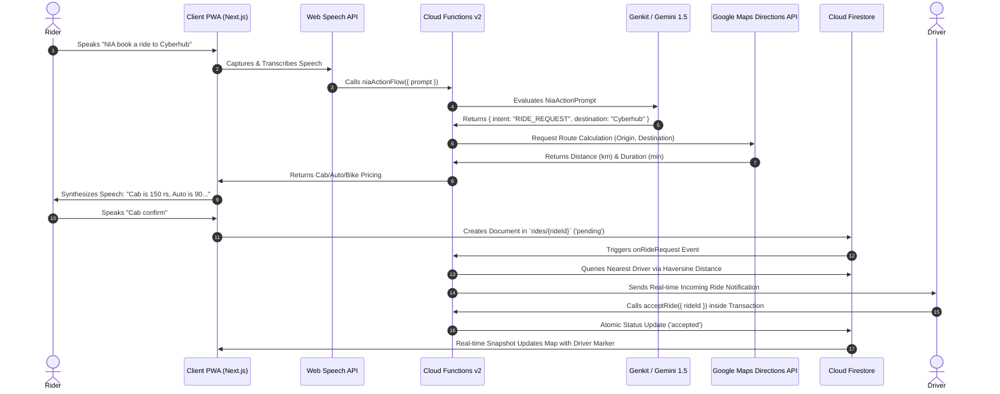
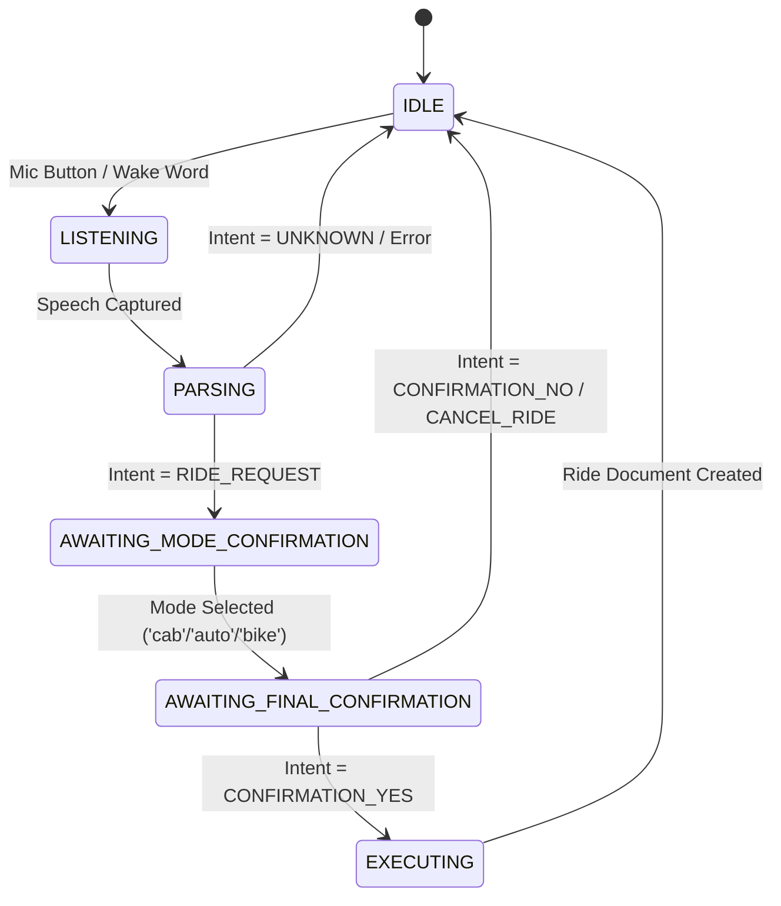
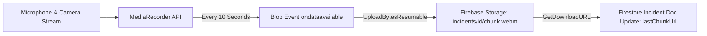

# Architecture Documentation — NIA Safety Rides

## 1. System Overview

**NIA Safety Rides** is built on a serverless, event-driven cloud architecture combining Next.js 15 App Router, Firebase v2 Cloud Functions, Google Genkit NLU pipelines, and Cloud Firestore.

---

## 2. Conversational Voice Dialog State Machine

The client manages a multi-stage voice state machine in `HomeClient.tsx`:

---

## 3. Reactive Dispatch & Concurrency Control

### Event-Driven Matching (`onRideRequest`)
1. A new ride document is written to `rides/{rideId}` with `status: 'pending'`.
2. The `onDocumentCreated("rides/{rideId}")` trigger activates `notifyDriverOnRideRequest()`.
3. The function calculates the Haversine spherical distance between `pickupLocation` and all drivers with `isOnline == true` in `driver_locations`.
4. The closest driver is marked in `notifiedDriverId` and receives a push notification.

### Retry & Fallback Loop (`onRideUpdate`)
1. If the notified driver declines, their UID is added to the `declinedBy` array in Firestore.
2. The `onDocumentUpdated("rides/{rideId}")` trigger detects the decline and re-executes `notifyDriverOnRideRequest()`, excluding all drivers in `declinedBy` to dispatch the next nearest driver.

### Atomic Concurrency Protection (`acceptRide`)
When a driver accepts a ride, the Callable Cloud Function executes a Firestore transaction (`db.runTransaction`). It verifies that `status == 'pending'` before writing `status: 'accepted'`, preventing two drivers from simultaneously accepting the same request.

---

## 4. Continuous Emergency Media Streaming Pipeline

