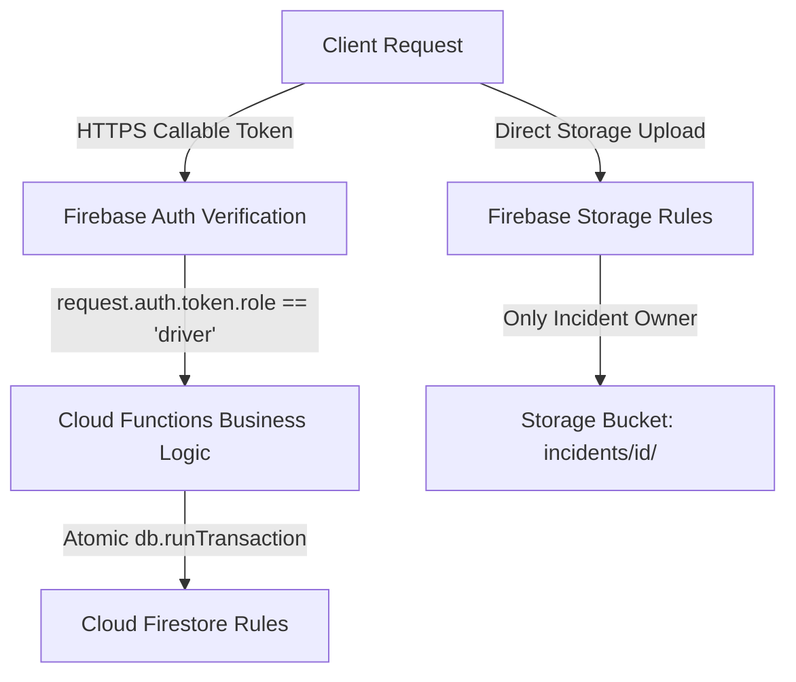

# Security & Hardening Guide — NIA Safety Rides

## 1. Security Architecture & Threat Model

NIA Safety Rides handles sensitive user transit and emergency data. The platform implements multi-layer defense:

---

## 2. Firestore & Storage Security Rules

### Firestore Rules (`firestore.rules`)
- **User Profiles (`/users/{userId}`)**: Read and update restricted to document owner (`request.auth.uid == userId`).
- **Driver Locations (`/driver_locations/{driverId}`)**: Writes restricted to verified drivers updating their own coordinates.
- **Rides (`/rides/{rideId}`)**: Riders can create rides for themselves and cancel pending requests. Status transitions to `in-progress` or `completed` require authenticated driver ownership.
- **Incidents (`/incidents/{incidentId}`)**: Created by authenticated users; read/update restricted to owner or admin.

### Storage Rules (`storage.rules`)
- **Emergency Incident Recordings (`/incidents/{incidentId}/{allPaths=**}`)**: Writes permitted only if the calling user owns the corresponding Firestore incident document.

---

## 3. Publication Readiness & Hardening Checklist

- [x] Configure `.gitignore` to prevent secret commits (`.env`, `*API_KEY*.txt`, logs).
- [x] Remove legacy starter templates from compilation scope (`tsconfig.json`).
- [ ] Connect production Firebase Authentication (Phone OTP / Google OAuth) replacing mock session provider.
- [ ] Implement Firebase App Check to protect Callable Cloud Functions from unauthorized API scrapers.
